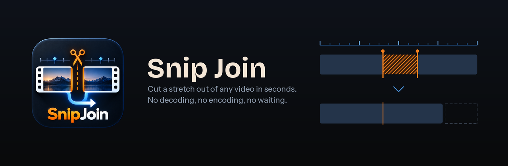
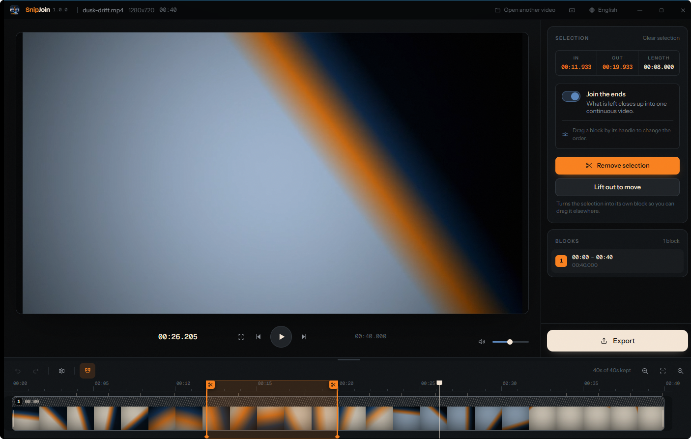
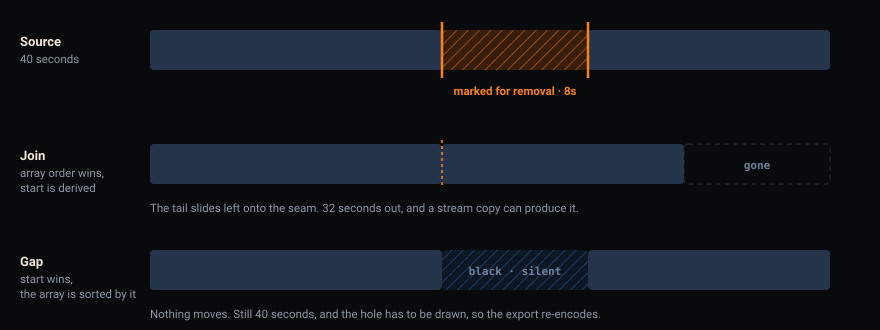
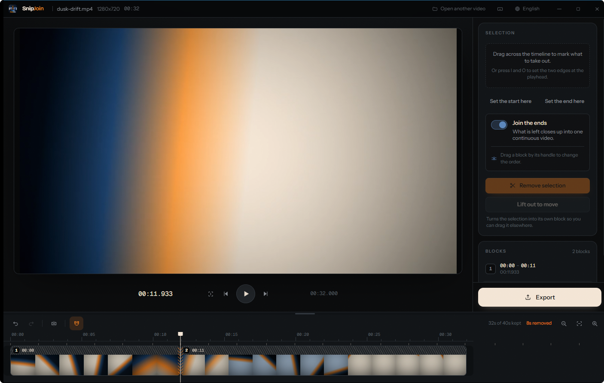
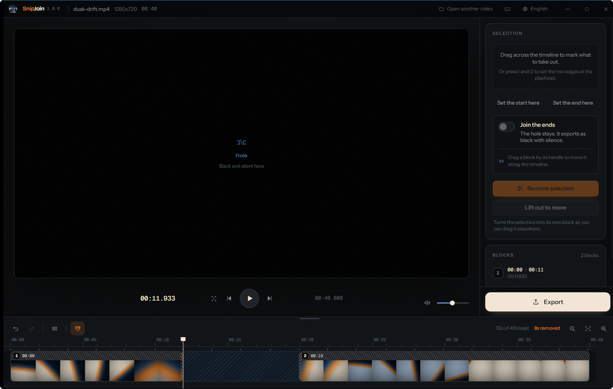
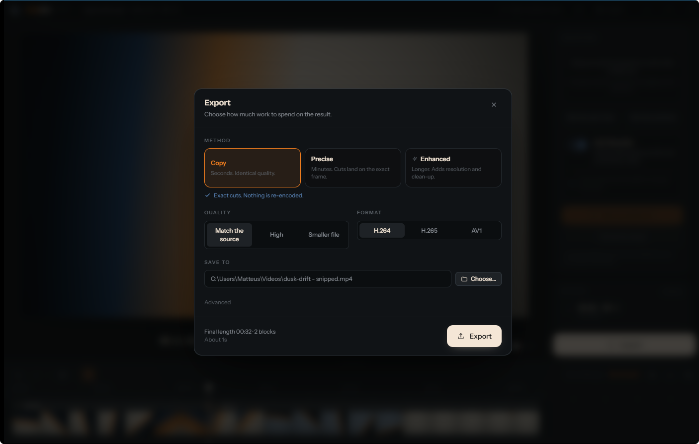
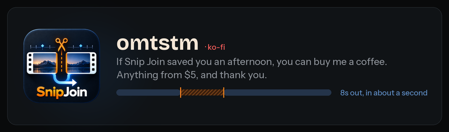

<p align="center">
  
</p>

<p align="center">
  <a href="../../releases/latest"></a>
  <a href="../../actions/workflows/ci.yml"></a>
  <a href="LICENSE"></a>
  
  
  <a href="https://ko-fi.com/omtstm"></a>
</p>

---

Most editors make you learn a timeline before you can delete thirty seconds from
the middle of a recording. Snip Join does that one thing, and does it with the
precision and finish of a paid tool.

<p align="center">
  
</p>

<p align="center">
  <em>Eight seconds marked, from 00:12.000 to 00:20.000. Both edges are on cut
  points — the small marks under the ruler — which is what lets the export copy
  the stream instead of re-encoding it.</em>
</p>

## Contents

- [What it does](#what-it-does)
- [Keeping the work](#keeping-the-work)
- [Cutting without re-encoding](#cutting-without-re-encoding)
- [Exporting](#exporting)
- [Sizing the timeline](#sizing-the-timeline)
- [Keyboard](#keyboard)
- [Languages](#languages)
- [Installing](#installing)
- [Building it](#building-it)
- [How it is built](#how-it-is-built)
- [Support](#support)

## What it does

**Mark and remove.** Drag across the timeline. Two orange rails show exactly what
goes. Press Remove.

**Join, or don't.** With *Join the ends* on, what is left closes up into one
continuous video. Turn it off and the hole stays exactly where it was — it
exports as black with silence, and the video keeps its original length.

<p align="center">
  
</p>

<p align="center">
  
</p>

<p align="center">
  <em>Joined. The two survivors meet at a torn edge — the mark for a seam you
  made, as opposed to the clean edges the original file came with — and the
  counter says 32s of 40s kept.</em>
</p>

<p align="center">
  
</p>

<p align="center">
  <em>The same cut with joining off. Nothing moved, the video is still forty
  seconds, and the playhead inside the hole previews exactly what will be
  exported there.</em>
</p>

**Blocks.** The video starts as one block. Every cut splits it, and each piece is
numbered in the order it plays. Grab a block by its ridged handle to move it:
with joining on you are changing the running order, with joining off you are
placing it anywhere on the timeline. Carry one past its neighbour and the two
glide into each other's places while you watch — no block is ever drawn on top
of another. Drag an edge to trim; an edge stops where the next block begins. A
torn orange edge marks a seam you made; a clean edge is the original boundary.
Turn on the follow control in the timeline's toolbar and reaching the side of
the window scrolls the view, so the far end of a long block is never out of
reach; it is off by default, because a view that moves on its own while you are
holding something is not always what you want.

**Pick a block up.** Click one and it wears a pale ring: that is the piece the
keyboard is about to act on. `Delete` removes it, `Ctrl`+`C` and `Ctrl`+`X` put
it aside, `Ctrl`+`V` drops it back in at the playhead, and `Alt`+`←` `→` walks it
along the running order without going near the handle. Right-click for the same
list, plus *Duplicate*.

**Or reorder them as a list.** *Blocks* on the right is the running order written
out, and a row can be dragged up or down by its grip to change it — the timeline
follows. Finding room in a strip is one way to say "play this third"; dropping a
row between two others is the other, and holes you left on the timeline are kept
where they are.

You can delete every block. An empty timeline is a fresh start, not a dead end —
the files stay in *Media*, and dragging one back in starts the edit again.

**Several files.** Add more with the folder button beside *Media*. Clicking a
file asks whether to put it on the end; dragging it out of the list drops it
wherever you let go, with a blue marker showing exactly where that is.

**Still images too.** Drop in a PNG or a JPEG and it becomes a block like any
other — five seconds by default, dragged to any length up to a minute. A
container claims a still is a fortieth of a second long; the editor ignores that
and the export draws the frame for as long as you asked.

**Lift out to move.** Turns the marked stretch into its own block without
deleting anything, so you can drag that moment somewhere else entirely.

**Almost any format.** MP4, MOV, MKV, AVI, WMV, FLV, TS, MTS, WebM, ProRes, HEVC,
10-bit, and the rest. Anything the web view cannot decode gets a lightweight
preview copy built automatically in the background — the export always reads the
original file.

## Keeping the work

An edit is a list of decisions about files that already exist, so a project is a
small text file naming them and where each cut falls. Nothing is copied and
nothing is locked: the video stays where it is on disk.

**Save it, or don't.** *Save project* asks where the first time and afterwards
writes back to the same file. Once it has a name it is also written every half a
minute while you work, which is there for the power going out rather than for
you — the most you can lose is the last half minute.

**Reopen it.** Every file it names is read again from disk, because their length
and their streams are properties of the file today rather than of the day you
saved. A file that has moved is marked in *Media* with the choice of finding it
again or dropping it; the blocks that read from it stay where they are until you
decide, since an edit is not something to rewrite because a file moved.

**Closing puts the editor down, not the application.** The window goes back to
the front door, with the projects you were last in listed there — closing one
edit is usually the moment before opening another. Unsaved work is asked about
first. Close again from there and it really does quit.

## Cutting without re-encoding

The default. The video is copied rather than decoded and encoded again, so a
cut finishes in seconds and uses essentially no processor or graphics card — the
same idea as LosslessCut, on any machine.

The catch with any copy-based cut is that a copy can only begin on a keyframe,
which in most tools means your cut quietly slides backwards by a second or two.
Snip Join does two things about it. The timeline shows those positions as small
marks above the track and snaps the selection onto them, so a cut placed on one
copies everything and touches nothing. And a cut placed *between* two of them
still lands on the frame you chose: only the few frames between the cut and the
nearest keyframe are re-encoded, the rest of the video is copied as it is, and
the dialog tells you how much that is — usually a second or two out of the
whole file.

<p align="center">
  
</p>

<p align="center">
  <em>Both edges are on cut points, so the dialog commits to it in words before
  anything runs — and estimates about a second for a forty second file.</em>
</p>

**Precise** re-encodes the whole video instead, and is what runs when a copy
cannot honour the timeline: several files on it, an image, or a video in a
format whose packets cannot be joined with re-encoded ones (Copy handles H.264
and H.265 in MP4, MOV, MKV and WebM, which is nearly everything a phone, a
camera or a screen recorder writes).

## Exporting

Three methods, and the difference is minutes of your time:

| | Speed | What happens |
| --- | --- | --- |
| **Copy** | Seconds | The video is copied, not re-encoded, and keeps its original quality. Only the frames beside each cut are re-encoded, so every cut lands on the frame you chose. A hole is drawn in between. |
| **Precise** | Minutes | Re-encoded so every cut lands on the exact frame you chose. Quality is set to be indistinguishable from the source. |
| **Enhanced** | Longer | Precise, plus upscaling and clean-up. Expect several times the length of the video. |

Where Copy cannot honour the timeline — more than one file, an image, or a hole
in a video whose format does not allow it — the dialog says so and picks Precise,
rather than quietly taking four minutes over what you asked to take four
seconds.

### Enhanced

- **Resolution** — Lanczos on the processor, or EWA Lanczos on the graphics card
  through Vulkan, optionally followed by contrast-adaptive sharpening. Scale 1.5x
  to 4x. GPU options appear only if a usable device is actually found, tested at
  startup rather than assumed.
- **Clean-up** — noise reduction, sharpening, and banding smoothing, each off,
  light, medium or strong. Applied in a fixed order: denoise before scaling so
  grain is not magnified, sharpen after so it acts on the final pixel grid.
- **Format** — H.264, H.265 or AV1, encoded on NVENC, Quick Sync, AMF or the CPU,
  whichever the machine actually has. Ten-bit sources keep their depth where the
  codec allows it.

## Sizing the timeline

Drag the divider between the picture and the timeline to give the filmstrip more
room — useful when you are hunting for an exact moment rather than watching. It
starts at its normal size and only grows, up to about two and a half times,
stopping earlier on a short window so the picture always keeps its space.
Double-click the divider to put it back. Arrow keys work too once it has focus.

The size is remembered between sessions.

## Keyboard

| | |
| --- | --- |
| `Space` | Play or pause |
| `←` `→` | One frame |
| `Shift` + `←` `→` | One second |
| `I` / `O` | Mark the start / end of the selection |
| `Delete` | Remove the selection, or the chosen block when nothing is marked |
| `S` | Split at the playhead |
| `Ctrl` + `C` / `X` | Copy / cut the chosen block |
| `Ctrl` + `V` | Paste it back in at the playhead |
| `Alt` + `←` `→` | Move the chosen block along the running order |
| `Esc` | Clear the selection |
| `Ctrl` + `Z` / `Y` | Undo / redo |
| `Ctrl` + `E` | Export |
| `Ctrl` + `O` | Open a video |
| `Ctrl` + `N` | Open a project |
| `Ctrl` + `W` | Close the project, or quit from the welcome screen |
| `Ctrl` + wheel | Zoom the timeline around the pointer |
| `↑` `↓` on the divider | Resize the timeline |

The mark in the title bar opens this page.

## Languages

Starts in the language of the operating system — English, Português (Brasil),
Español or 中文 — and falls back to English for anything else. Switchable from
the title bar at any time.

## Installing

**FFmpeg is included.** There is nothing to install separately and nothing to put
on your PATH. Each release carries the current FFmpeg release build, fetched
automatically at packaging time.

**Updating.** The download button in the title bar asks GitHub what the newest
release is and, if it is ahead of the copy running, fetches the right file for it
— the installer for an installed copy, the archive for a portable one. Every
release is signed, and an update whose signature does not check out against the
key built into Snip Join is deleted rather than offered.

Nothing is left behind afterwards: the download, the folder it was unpacked into
and the copy it replaced are all swept on the next start, and the file never
lands in your downloads folder to begin with.

Installing takes a moment and needs no attention: an installed copy closes so its
installer can replace it, and a portable copy closes, puts the new version in its
own folder — keeping everything under `data` — and starts again. Unsaved work is
asked about first either way.

Nothing is checked, fetched or run unless you press the button: the application
makes no network request of its own accord.

Two ways to get it, both in `src-tauri/target/release/bundle/`:

| | |
| --- | --- |
| `nsis/Snip Join_*-setup.exe` | Ordinary installer. Registers *Open with → Snip Join*. |
| `portable/Snip Join_*_portable.zip` | Unzip and run. No installer, no registry. |

The portable copy keeps everything it writes — preview cache, export scratch,
settings — in a `data` folder beside the executable. Nothing touches your user
profile. Deleting `portable.txt` turns it back into an ordinary copy.

## Building it

```bash
pnpm install
pnpm app:dev        # development, with hot reload
pnpm ffmpeg:fetch   # pull the FFmpeg that gets bundled
pnpm app:build      # installers
pnpm app:portable   # installers plus the portable zip
```

You can also open a file directly:

```bash
pnpm app:dev -- -- "C:\clips\holiday.mp4"
```

Built installers register the same behaviour, so *Open with → Snip Join* works.

## How it is built

Tauri 2 with a Rust backend and a React 19 renderer, layered so the editing rules
know nothing about FFmpeg and FFmpeg knows nothing about the window. The whole
export routing decision is a pure function returning a list of commands, which is
why it can be tested without encoding anything.

Covered by 132 Rust unit tests, 13 end-to-end tests that drive real FFmpeg and
assert on the resulting files, and 120 renderer tests. See
[CLAUDE.md](CLAUDE.md) for the architecture and the traps.

The interface takes its palette straight from the logo: `#F9811E` is the
scissors, `#F4E6D6` is the "Join" lettering. Orange means cutting and nothing
else, which is why the Export button is not orange.

## Support

<p align="center">
  <a href="https://ko-fi.com/omtstm">
    
  </a>
</p>

Snip Join is free, MIT-licensed, and built in the open. If it saved you an
afternoon of waiting on an export, you can put something in the tip jar —
**anything from $5**, and it is genuinely appreciated.

<p align="center">
  <a href="https://ko-fi.com/omtstm">
    
  </a>
</p>

Nothing here is gated behind it. There is no paid tier, no nag screen, and the
program will never ask — the credit line on the splash and the welcome screen is
the whole of it.

## Contributing

[CONTRIBUTING.md](CONTRIBUTING.md) states the one invariant that is easy to
break without noticing — which field is authoritative in each mode — along with
the layering rules and the traps that have already cost a day.

Security posture and how to report a vulnerability: [SECURITY.md](SECURITY.md).

## License

[MIT](LICENSE). FFmpeg is bundled separately under its own terms; the shared
GPL build is used for x264, x265, SVT-AV1 and libplacebo.
