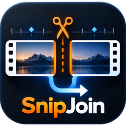

<p align="center">
  
</p>

<h1 align="center">Snip Join</h1>

<p align="center">
  <strong>Take a stretch out of a video. Join what is left, or leave the hole.</strong>
</p>

<p align="center">
  <a href="../../releases/latest"></a>
  <a href="../../actions/workflows/ci.yml"></a>
  <a href="LICENSE"></a>
  
  
</p>

---

Most editors make you learn a timeline before you can delete thirty seconds from
the middle of a recording. Snip Join does that one thing, and does it with the
precision and finish of a paid tool.

## Contents

- [What it does](#what-it-does)
- [Cutting without re-encoding](#cutting-without-re-encoding)
- [Exporting](#exporting)
- [Sizing the timeline](#sizing-the-timeline)
- [Keyboard](#keyboard)
- [Languages](#languages)
- [Installing](#installing)
- [Building it](#building-it)
- [How it is built](#how-it-is-built)

## What it does

**Mark and remove.** Drag across the timeline. Two orange rails show exactly what
goes. Press Remove.

**Join, or don't.** With *Join the ends* on, what is left closes up into one
continuous video. Turn it off and the hole stays exactly where it was — it
exports as black with silence, and the video keeps its original length.

**Blocks.** The video starts as one block. Every cut splits it, and each piece is
numbered in the order it plays. Grab a block by its ridged handle to move it:
with joining on you are changing the running order, with joining off you are
placing it anywhere on the timeline. Drag an edge to trim. A torn orange edge
marks a seam you made; a clean edge is the original boundary.

**Lift out to move.** Turns the marked stretch into its own block without
deleting anything, so you can drag that moment somewhere else entirely.

**Almost any format.** MP4, MOV, MKV, AVI, WMV, FLV, TS, MTS, WebM, ProRes, HEVC,
10-bit, and the rest. Anything the web view cannot decode gets a lightweight
preview copy built automatically in the background — the export always reads the
original file.

## Cutting without re-encoding

The default. Nothing is decoded and nothing is encoded, so a cut finishes in
seconds and uses essentially no processor or graphics card — the same idea as
LosslessCut, on any machine.

The catch with any copy-based cut is that it can only begin on a keyframe, which
usually means your cut quietly slides backwards by a second or two. Snip Join
shows you those positions as small marks above the timeline and snaps the
selection onto them, so the cut lands exactly where you see it. The export dialog
confirms it in words: **"Exact cuts. Nothing is re-encoded."** — and if an edge
did end up between two of them, it tells you how far it will move instead of
letting you find out afterwards.

If you need a cut on one specific frame rather than the nearest cut point, that
is what **Precise** is for.

## Exporting

Three methods, and the difference is minutes of your time:

| | Speed | What happens |
| --- | --- | --- |
| **Copy** | Seconds | Nothing is re-encoded, and no processor or graphics work is needed. The result is bit for bit the original. Cuts land on cut points, which the timeline snaps to. |
| **Precise** | Minutes | Re-encoded so every cut lands on the exact frame you chose. Quality is set to be indistinguishable from the source. |
| **Enhanced** | Longer | Precise, plus upscaling and clean-up. Expect several times the length of the video. |

Copy is unavailable when the timeline has a hole — a hole has to be drawn, and
nothing can be drawn into a copied stream. The dialog says so rather than quietly
taking four minutes over what you asked to take four seconds.

### Enhanced

- **Resolution** — Lanczos on the processor, or EWA Lanczos on the graphics card
  through Vulkan, optionally followed by contrast-adaptive sharpening. Scale 1.5x
  to 4x. GPU options appear only if a usable device is actually found, tested at
  startup rather than assumed.
- **Clean-up** — noise reduction, sharpening, and banding smoothing, each off,
  light, medium or strong. Applied in a fixed order: denoise before scaling so
  grain is not magnified, sharpen after so it acts on the final pixel grid.
- **Format** — H.264, H.265 or AV1, encoded on NVENC, Quick Sync, AMF or the CPU,
  whichever the machine actually has. Ten-bit sources keep their depth where the
  codec allows it.

## Sizing the timeline

Drag the divider between the picture and the timeline to give the filmstrip more
room — useful when you are hunting for an exact moment rather than watching. It
starts at its normal size and only grows, up to about two and a half times,
stopping earlier on a short window so the picture always keeps its space.
Double-click the divider to put it back. Arrow keys work too once it has focus.

The size is remembered between sessions.

## Keyboard

| | |
| --- | --- |
| `Space` | Play or pause |
| `←` `→` | One frame |
| `Shift` + `←` `→` | One second |
| `I` / `O` | Mark the start / end of the selection |
| `Delete` | Remove the selection |
| `S` | Split at the playhead |
| `Esc` | Clear the selection |
| `Ctrl` + `Z` / `Y` | Undo / redo |
| `Ctrl` + `E` | Export |
| `Ctrl` + wheel | Zoom the timeline around the pointer |
| `↑` `↓` on the divider | Resize the timeline |

## Languages

Starts in the language of the operating system — English, Português (Brasil),
Español or 中文 — and falls back to English for anything else. Switchable from
the title bar at any time.

## Installing

**FFmpeg is included.** There is nothing to install separately and nothing to put
on your PATH. Each release carries the current FFmpeg release build, fetched
automatically at packaging time.

Three ways to get it, all in `src-tauri/target/release/bundle/`:

| | |
| --- | --- |
| `nsis/Snip Join_*-setup.exe` | Ordinary installer. Registers *Open with → Snip Join*. |
| `msi/Snip Join_*.msi` | Same, for managed deployment. |
| `portable/Snip Join_*_portable.zip` | Unzip and run. No installer, no registry. |

The portable copy keeps everything it writes — preview cache, export scratch,
settings — in a `data` folder beside the executable. Nothing touches your user
profile. Deleting `portable.txt` turns it back into an ordinary copy.

## Building it

```bash
pnpm install
pnpm app:dev        # development, with hot reload
pnpm ffmpeg:fetch   # pull the FFmpeg that gets bundled
pnpm app:build      # installers
pnpm app:portable   # installers plus the portable zip
```

You can also open a file directly:

```bash
pnpm app:dev -- -- "C:\clips\holiday.mp4"
```

Built installers register the same behaviour, so *Open with → Snip Join* works.

## How it is built

Tauri 2 with a Rust backend and a React 19 renderer, layered so the editing rules
know nothing about FFmpeg and FFmpeg knows nothing about the window. The whole
export routing decision is a pure function returning a list of commands, which is
why it can be tested without encoding anything.

Covered by 119 Rust unit tests, 8 end-to-end tests that drive real FFmpeg and
assert on the resulting files, and 72 renderer tests. See
[CLAUDE.md](CLAUDE.md) for the architecture and the traps.

The interface takes its palette straight from the logo: `#F9811E` is the
scissors, `#F4E6D6` is the "Join" lettering. Orange means cutting and nothing
else, which is why the Export button is not orange.

## Contributing

[CONTRIBUTING.md](CONTRIBUTING.md) states the one invariant that is easy to
break without noticing — which field is authoritative in each mode — along with
the layering rules and the traps that have already cost a day.

Security posture and how to report a vulnerability: [SECURITY.md](SECURITY.md).

## License

[MIT](LICENSE). FFmpeg is bundled separately under its own terms; the shared
GPL build is used for x264, x265, SVT-AV1 and libplacebo.
